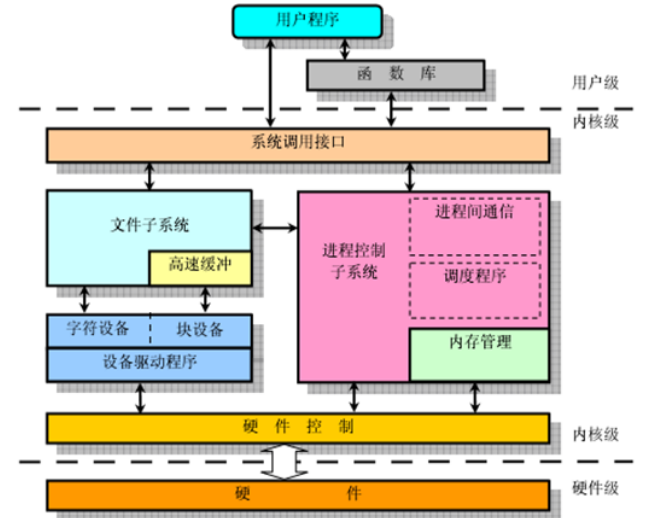

# Linux

- [ ] Linux概述
- [ ] 系统安装与分区
- [ ] 常用命令与目录结构
- [ ] 用户、用户组、其他人

## Linux概述

### Linux系统分析

## 常用命令和目录结构

### 获取命令的帮助

* `whatis`：如果不成功，则执行`makewhatis`
* 使用`help`查看内建命令的帮助（`enable`查看内建命令）
* `man`：`enter`按行翻，空格按页翻；`HOME/END`快速到首页/尾页
* `info`

### 目录结构

| 作用                 | 目录                            |
| :------------------- | :------------------------------ |
| Home（家）目录       | /root,/home{UserName}           |
| 普通用户可执行文件   | /bin,/usr/bin,/usr/local/bin    |
| 系统管理员可执行文件 | /sbin,/usr/sbin,/usr/local/sbin |
| 配置文件目录         | /etc                            |
| 临时文件目录         | /tmp                            |
| 内核和启动文件       | /boot                           |
| 服务器数据           | /var,/srv                       |
| 系统信息             | /proc,/sys                      |
| 共享库               | /lib,/usr/lib,/usr/local/lib    |
| 其他挂载点           | /media,/mnt                     |

* 文件或目录名：<=255个字符，区分大小写，**不能使用** `"/"`

## 运行级别

> 使用`who -r`查看当前运行级别以及系统当前时间

## 用户和用户组

### 用户和UID

* `root`用户：超级管理员，`UID`是0
* 系统用户：`UID`是1-499
* 自定义用户：`UID`从500开始

### 用户信息存储位置

* 账户信息存储于`/etc/passwd`
* 密码信息存储于`/etc/shadow`
* 创建用户的同时，默认还会为用户创建一个同名的组，组信息保存在`/etc/group`中
