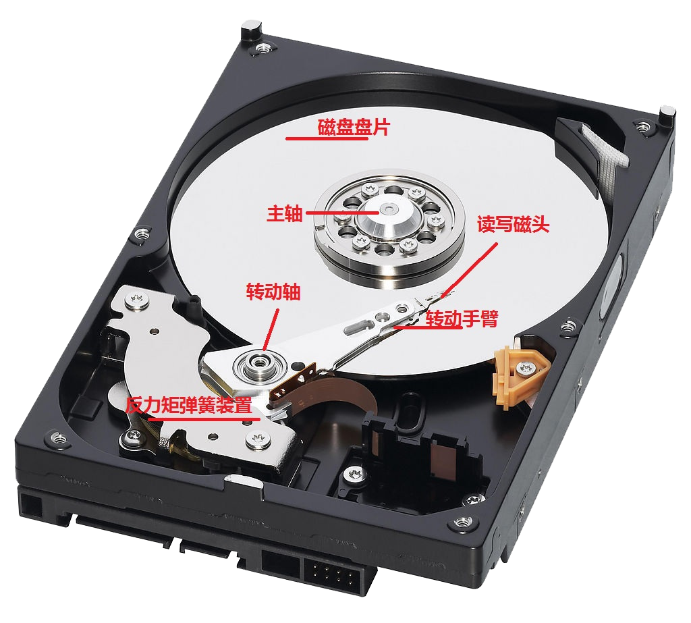

# Linux  

- [ ] 用户、用户组、其他人与权限
- [ ] 磁盘与文件系统

## 用户、用户组和权限

### 用户身份与用户组记录的文件

在`Linux`系统中，默认情况下所有的系统上的账号信息都记录在`/etc/passwd`这个文件内，包括`root`用户。
个人密码记录在`/etc/shadow`文件内。
所有`Linux`组名记录在`/etc/group`内。

### 用户管理

#### 添加用户

> `useradd [选项] 用户名`

| 选项   | 说明                               |
| :----- | :--------------------------------- |
| -c     | 指定一段注释性描述                 |
| -d     | 指定用户主目录                     |
| &nbsp; | 此目录不存在时使用-m选项创建主目录 |
| -g     | 指定用户所属的用户组               |
| -G     | 指定用户所属的附加组               |
| -s     | 指定用户的登录`shell`              |
| -u     | 指定用户的用户号                   |

#### 修改用户

> `usermod [选项] 用户名`

* 常用选项包括`-c, -d, -m, -g, -G, -s, -u`等，可以为用户指定新的资源值

#### 用户口令的管理

> `passwd [选项] 用户名`

| 选项   | 说明                     |
| :----- | :----------------------- |
| -l     | 锁定口令，禁用账号       |
| -u     | 口令解锁                 |
| -d     | 使账号无口令，即删除密码 |
| &nbsp; | 仅管理员有效             |

#### 切换用户

> `su 目标用户`

* 管理员切换普通用户不需要输入密码
* 普通用户切换至管理员需要输入密码

#### 删除用户

> `userdel 用户名`

* 使用`userdel -r 用户名`在删除指定用户的同时删除他的`home`目录

### 用户组管理

每个用户都有一个用户组，系统可以对一个用户组中的所有用户进行集中管理。
用户组的管理涉及用户组的添加、修改和删除，实际上就是对`/etc/group`文件的更新。

#### 添加用户组

> `groupadd [选项] 用户组`

| 选项   | 说明                                               |
| :----- | :------------------------------------------------- |
| -g     | 指定新用户组的组标识号`GID`                        |
| -o     | 一般与`-g`选项同时使用                             |
| &nbsp; | 表示新用户组的`GID`可以与系统已有用户组的`GID`相同 |

#### 删除用户组

> `groupdel 用户组`

* 如果删除的用户组，已经被用户追加为 **附件组** ，**对应的所有用户的该附件组会被撤销掉**。
* 如果被删除的用户组，已经被用户指定为 **主组** ，则该用户组 **无法被删除**。

#### 修改用户组

> `groupmod [选项] 用户组`

| 选项   | 说明                                           |
| :----- | :--------------------------------------------- |
| -g     | 为用户组指定新的组标识号                       |
| -o     | 与`-g`选项同时使用                             |
| &nbsp; | 用户组的新`GID`可以与系统已有用户组的`GID`相同 |
| -n     | 将用户组的名字改为新名字                       |

#### 当前用户切换用户组

> `newgrp 用户组`

* 如果一个用户同时属于多个用户组，那么用户可以在用户组之间切换，以便具有其他用户组的权限。
* 用户可以在登录后，使用命令`newgrp`切换到其它用户组。

#### 伪用户

这些用户在`/etc/passwd`中也占有一条记录，但是不能登录，因为它们的登录`shell`为空。

> 存在的原因主要是方便系统管理，满足相应的系统进程对文件属主的要求。

| 伪用户名 | 含义                     |
| :------- | :----------------------- |
| bin      | 拥有可执行的用户命令文件 |
| sys      | 拥有系统文件             |
| adm      | 拥有账户文件             |
| uucp     | UUCP使用                 |
| Ip或Ipd  | 子系统使用               |
| nobody   | NFS使用                  |

### 权限

```
-rwx    r-x     r--     *.txt
user    group   other   文件名
```

#### 权限修改

> `chmod`

| 权限 | 数字 | 说明 |
| :--- | :--- | :--- |
| -r   | 4    | 读   |
| -w   | 2    | 写   |
| -x   | 1    | 执行 |

#### 物理权限

> `chattr [-RVf] [-v version] [mode] files`

* 此命令可以用来锁定某个文件不能被修改
* 但是不能修改保护`/,/dev,/tmp,/var`目录

| 选项    | 说明                                             |
| :------ | :----------------------------------------------- |
| -a      | 让文件或目录仅供附加用途                         |
| -b      | 不更新文件或目录的最后存取时间                   |
| -c      | 将文件或目录压缩后存放                           |
| -d      | 将文件或目录排除在倾倒操作之外                   |
| -i      | 不得任意更动文件或目录                           |
| -s      | 保密性删除文件或目录                             |
| -S      | 即时更新文件或目录                               |
| -u      | 预防意外删除                                     |
| -R      | 递归处理，将指令目录下的所有文件及子目录一并处理 |
| -v      | 设置文件或目录版本                               |
| -V      | 显示指令执行过程                                 |
| +<属性> | 开启文件或目录的该项属性                         |
| -<属性> | 关闭文件或目录的该项属性                         |
| =<属性> | 指定文件或目录的该项属性                         |

#### 物理权限查看

> `lsattr [-RVadv] [files]`

| 选项 | 说明                                        |
| :--- | :------------------------------------------ |
| -R   | 递归显示目录下所有子目录和文件的属性        |
| -V   | 显示`lsattr`程序的版本信息                  |
| -a   | 显示所有文件的属性信息，包括以`.`开头的文件 |
| -d   | 显示目录的属性，而不是目录下的文件的属性    |
| -v   | 显示文件的档案号码                          |

#### 普通用户的root权限

通过修改`/etc/sudoers`文件使普通用户可以执行`sudo`命令，该命令代表`root`执行。

* 不需要知道`root`密码，保证`root`的密码安全
* 可以限制用户执行有限的`root`权限
* `sudo`执行的每条命令都会被记录，便于日后的日志审计

```
/etc/sudoers    98lines
-admin ALL=(ALL) ALL
```

## 磁盘与文件系统

## 磁盘物理结构



磁盘由一个个盘片组成，从盘片的结构上来看，图中的一圈圈灰色同心圆为一条条磁道，从圆心向外画直线，可以将磁道划分为若干个弧段，每个磁道上一个弧段被称为一个扇区。
扇区是磁盘的最小组成单元，通常是`512`字节。


### Ext2/Ext3/Ext4区别

* 均是文件系统格式——`NTFS`和`FAT32`
* Ext4是Ext3的改进版，修改了Ext3中部分重要的数据结构
* Ext3对Ext2，只是增加了一个日志功能
* Ext3只支持32000个子目录，而Ex4支持理论值的无限数量的子目录

### swap

> 当系统的物理内存不够用的时候，就需要将物理内存中的一部分空间释放出来，以供当前运行的程序使用。

* 8G以内的物理内存，swap设置为内存的2倍
* 8-16G以内的物理内存，swap设置为内存大小或者设置为8G
* 16-256G物理内存，swap设置为实际内存的$1/2$

## 网络

### OSI七层和TCP/IP四层的关系

| OSI七层网络模型 | 对应网络协议                         | TCP/IP四层概念模型 |
| :-------------- | :----------------------------------- | :----------------- |
| 应用层          | HTTP、TFTP、FTP、NFS、WAIS           | 应用层             |
| 表示层          | Telnet、Rlogin、SNMP、Gopher         | 应用层             |
| 会话层          | SMTP、DNS                            | 应用层             |
| 传输层          | TCP、UDP                             | 传输层             |
| 网络层          | IP、ICMP、ARP、RARP、AKP、UUCP       | 网络层             |
| 数据链路层      | FDDI、Ethernet、、PDN、SLIP、PPP     | 数据链路层         |
| 物理层          | IEEE 802.1A、IEEE 802.2到IEEE 802.11 | 数据链路层         |

* `OSI`引入了服务、接口、协议、分层的概念，`TCP/IP`借鉴了`OSI`的这些概念建立`TCP/IP`模型。
* `OSI`先有模型，后有协议，先有标准，后进行实践；而`TCP/IP`则相反，先有协议和应用再提出了模型，且是参照的`OSI`模型。
* `OSI`是一种理论下的模型，而`TCP/IP`已被广泛使用，成为网络互联事实上的标准。
* `TCP`：transmission control protocol **传输控制协议**
* `UDP`：user data protocol **用户数据包协议**

### Ddos攻击

> **分布式拒绝服务攻击** 一般理解为无法承载高负荷工作而导致瘫痪。
