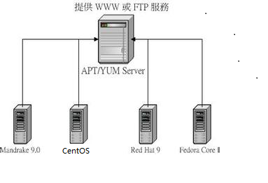

# Linux

- [ ] 软件包管理
- [ ] shell基础

## 软件包管理

### 文件压缩与打包

压缩：指通过某些算法，将文件尺寸进行相应的缩小，同时不损失文件的内容
打包：指将多个文件（或目录）合并成一个文件，方便传递或部署

* 压缩文件或打包文件常见的扩展名：`*.tar`,`*.tar.gz`,`*.gz`,`*.bz2`,`*.tar.bz2`,`*.Z`
* 常见的压缩/打包指令：
    * `compress`：压缩效率低下，压缩比也比较差，几乎已经不再使用
    * `gzip`与`bzip2`：`gzip`比`bzip2`性能好，但`bzip2`可以获得更高压缩比
    * `tar`：可以将很多文件打包成为一个文件

#### gzip

> 可以解开`compress`、`zip`与`gzip`等软件所压缩的文件。

| 选项           | 参数                                                      |
| :------------- | :-------------------------------------------------------- |
| -c             | 将压缩的数据输出到标准输出上                              |
| -d             | 解压缩                                                    |
| -t             | 可以用来检验一个压缩文件的一致性                          |
| -v             | 可以显示出原文件/压缩文件的压缩比信息                     |
| -(1,2,3,...,9) | 压缩等级，1最快，但压缩比最差；9最慢，但压缩比最高；默认6 |
| -l             | 查看压缩文件的压缩比                                      |

* `cat`可以读取纯文本文件,`zcat`则可以读取纯文本文件被压缩后的压缩文件

#### bzip2

> `gzip` 是为了取代 `compress` 并提供更好的压缩比,那么 `bzip2` 则是为了取代 `gzip` 并提供更佳的压缩比而来的

| 选项           | 参数                                  |
| :------------- | :------------------------------------ |
| -c             | 将压缩的过程产生的数据输出到标准输出  |
| -d             | 解压缩的参数                          |
| -k             | 保留源文件而不会删除原始的文件        |
| -f             | 强制压缩                              |
| -z             | 压缩的参数，可有可无                  |
| -v             | 可以显示出原文件/压缩文件的压缩比信息 |
| -(1,2,3,...,9) | 压缩比参数，9最佳1最慢                |

#### compress、uncompress

> 仅做了解，目前已不用,当前系统内核已不提供该命令

| 选项 | 参数                                                   |
| :--- | :----------------------------------------------------- |
| -r   | 可以连同目录下的文件也同时给予压缩                     |
| -c   | 将压缩数据输出成为`standard output`                    |
| -v   | 可以列出压缩后的文件信息以及压缩过程中的一些文件名变化 |

#### tar

| 选项   | 参数                                                        |
| :----- | :---------------------------------------------------------- |
| -c     | 建立打包文件                                                |
| -t     | 查看打包文件的内容含有哪些文件                              |
| -x     | 解打包或解压缩的功能，可以搭配`-C`在特定目录解开            |
| -j     | 通过`bzip2`的支持进行压缩/解压缩                            |
| &nbsp; | 此时文件最好为 `*.tar.bz2`                                  |
| -z     | 通过`gzip`的支持进行压缩/解压缩                             |
| &nbsp; | 此时文件最好为 `*.tar.gz`                                   |
| -v     | 在压缩/解压缩的过程中,将正在处理的文件名显示出来            |
| -f     | 后面跟处理后文件的全名称（路径+文件名+后缀名）              |
| -C     | 这个选项用在解压缩,若要在特定目录解压缩,可以使用这个选项    |
| -p     | 保留备份数据的原本权限与属性,常用于备份`(-c)`重要的配置文件 |

* `-c`, `-t`, `-x` **不可同时出现在一串指令列中**

### rpm安装软件

#### rpm的优点

RPM内含已经编译过的程序与配置文件等数据,可以让用户免除重新编译的困扰
RPM在被安装之前,会先检查系统的硬盘容量、操作系统版本等,可避免文件被错误安装
RPM文件本身提供软件版本信息、相依属性软件名称、软件用途说明、软件所含文件等信息,便于了解软件
RPM管理的方式使用数据库记录 RPM 文件的相关参数,便于升级、移除、查询与验证

#### rpm默认安装的路径

* `/etc`：一些配置文件放置的目录,例如`/etc/crontab`
* `/usr/bin`：一些可执行文件
* `/usr/lib`：一些程序使用的动态链接库
* `/usr/share/doc`：一些基本的软件使用手册与说明文件
* `/usr/share/man`：一些`man` `page`（Linux命令的随机帮助说明）文件

| 选项       | 参数                                                 |
| :--------- | :--------------------------------------------------- |
| -i         | install                                              |
| -v         | 查看更细节的安装信息画面                             |
| -h         | 显示指令执行过程                                     |
| -q         | 仅查询,后面接的软件名称是否有安装                    |
| -qa        | 列出所有的,已经安装在本机Linux系统上面的所有软件名称 |
| -RPqi      | 列出该软件的详细信息,包含开发商、版本和说明等        |
| -ql        | 列出该软件所有的文件与目录所在完整文件名             |
| -qc        | 列出该软件的所有配置文件                             |
| -qd        | 列出该软件的所有说明文件                             |
| -qR        | 列出和该软件有关的相依软件所含的文件                 |
| -qf        | 由后面接的文件名,找出该文件属于哪一个已安装的软件    |
| -qp[icdlR] | 查询rpm包中的信息                                    |
### yum安删更软件

`yum`是通过分析`RPM`的标头资料后,根据各软件的相关性制作出属性相依时的解决方案,然后可以自动处理软件的依赖问题,以解决软件安装、移除、升级中遇到的繁琐操作的问题。

基本配置：`/etc/yum.repos.d`

| 选项   | 参数                                                     |
| :----- | :------------------------------------------------------- |
| search | 查询某个软件名称或者是描述的关键字                       |
| list   | 列出目前`yum`所管理的所有的软件名称与版本,有点类似 `rpm` |
-qa 
info|同上,格式不太一样,不过有点类似 `rpm -qai` 的执行结果

### yum进阶

#### yum服务器与客户端架构图



#### yum客户端运行机制

客户端每次使用`yum`调用`install`或者`search`的时候，都会去解析`/etc/yum.repos.d/`下面所有以`.repo`结尾的文件，这些配置文件指定了`yum`服务器的地址。
`yum`需要定期去“更新”`yum`服务器上的`rpm` “清单” ，然后把“清单”下载保存到`yum`自己的`cache`里面，根据`/etc/yum.conf`里配置(默认是在`/var/cache/yum/$basearch/$releasever`下、即`/var/cache/yum/x86_64/6`），每次调用`yum`安装包的时候都会去这个`cache`目录下去找“清单”，根据“清单”里的`rpm`包描述从而来确定安装包的名字，版本号，所需要的依赖包等，如果`rpm`包的`cache`不存在，就去`yum`服务器下载`rpm`包安装。

## Shell基础

### 变量总结

* 全局变量：一般全大写，如环境变量
* 局部变量：脚本函数中的局部变量通常使用`local`修饰
    * `local` `I`表示`i`变量的有效范围在该函数内部有效。
* 把一个命令定义成一个变量 `$(命令)` 或 `命令`
* `${WEEK}day`若变量和其他字符组成新的变量就必须给变量加上大括号，否则容易出错

### 数据重定向

* 标准输入（stdin）:编号为0
* 标准输出（stdout）:编号为1
* 标准错误输出（stderr）:编号为2

| 选项 | 参数                                    |
| ---- | --------------------------------------- |
| 1>   | 以覆盖的方法,将正确的数据输出到文件     |
| 1>>  | 以累加的方法,将正确的数据输出到文件     |
| 2>   | 以覆盖的方法,将错误输出的数据输出到文件 |
| 2>>  | 以累加的方法,将错误输出的数据输出到文件 |

### 命令执行判断

> `$?:命令回传值`

* 命令回传值`$?`有两种：与 `&&` 或 `||`

```
&&：
     cmd1 && cmd2  若cmd1运行完毕且正确运行（$？=0），则开始运行cmd2；
                   若cmd1运行完毕且为错误（$？！=0），则cmd2不运行；
||：
     cmd1 ||  cmd2 若cmd1进行完毕且正确运行（$?=0），则cmd2不运行；
                   若cmd1运行完毕且为错误（$?!=0）,则开始运行cmd2;
  亦即不管与还是或，运行正确回传值均为0,不同的是与的时候运行cmd2,而或的时候不运行cmd2；
  若运行错误，则回传值均为非0,但与的时候不运行cmd2,而或的时候运行cmd2。
```
